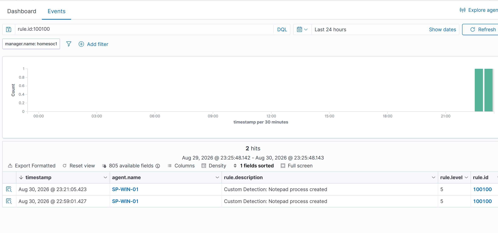
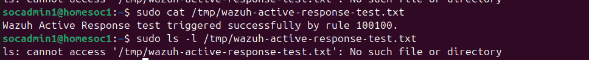

# Active Response

## Objective

The goal of this phase was to implement and validate a safe Wazuh Active Response workflow without making disruptive changes to the monitored Windows endpoint or home network.

Instead of using response actions such as firewall blocking, account disabling, or route changes, a harmless custom Active Response script was created on the Wazuh manager.

This allowed automated response capabilities to be demonstrated without affecting normal Windows functionality or network connectivity.

---

## Detection Trigger

The Active Response was linked to the custom Wazuh detection rule created earlier in the project.

- **Rule ID:** `100100`
- **Rule Level:** `5`
- **Description:** `Custom Detection: Notepad process created`
- **Data Source:** Sysmon Process Creation (Event ID 1)
- **Monitored Endpoint:** `SP-WIN-01`

The rule detects the execution of `notepad.exe` on the monitored Windows endpoint.

---

## Active Response Command

A custom Active Response command named `ar-test` was configured on the Wazuh manager.

```xml
<command>
  <name>ar-test</name>
  <executable>ar_test.py</executable>
  <timeout_allowed>yes</timeout_allowed>
</command>
```

The custom script was stored at:

```text
/var/ossec/active-response/bin/ar_test.py
```

The script was configured with restricted permissions and executed by the Wazuh Active Response framework.

---

## Active Response Configuration

The custom response was associated specifically with Rule `100100`.

```xml
<active-response>
  <disabled>no</disabled>
  <command>ar-test</command>
  <location>server</location>
  <rules_id>100100</rules_id>
  <timeout>30</timeout>
</active-response>
```

Important configuration choices:

- `rules_id` limits the response to custom Rule `100100`.
- `location` is set to `server`, so the response executes on the Wazuh manager rather than the Windows endpoint.
- `timeout` is set to `30` seconds to test automatic rollback.
- `timeout_allowed` enables the stateful response mechanism.

This design intentionally avoids making changes to the Windows firewall, network configuration, user accounts, registry, or other system settings.

---

## Custom Active Response Script

A custom Python script named `ar_test.py` was created on the Ubuntu Wazuh manager.

The script implements a harmless stateful Active Response test.

When the response is triggered, the script:

1. Receives the Active Response event from Wazuh.
2. Processes the triggering alert information.
3. Performs the required stateful Active Response handshake.
4. Creates a temporary marker file:

```text
/tmp/wazuh-active-response-test.txt
```

5. Writes a confirmation message containing the triggering rule ID.
6. Waits for Wazuh's timeout-based delete action.
7. Removes the temporary marker file when the response expires.

The marker file is used only as proof that the automated response executed successfully.

---

## Testing the Response

The test was triggered by opening **Notepad normally** on the monitored Windows endpoint.

The resulting flow was:

```text
Notepad.exe executed
        ↓
Sysmon Process Creation Event
        ↓
Wazuh Agent (SP-WIN-01)
        ↓
Wazuh Manager
        ↓
Custom Rule 100100
        ↓
Active Response ar-test
        ↓
Temporary Marker Created
        ↓
30-Second Timeout
        ↓
Temporary Marker Removed
```

---

## Detection Validation

The Wazuh dashboard successfully generated the custom alert.

Observed values included:

```text
Agent: SP-WIN-01
Rule ID: 100100
Rule Level: 5
Description: Custom Detection: Notepad process created
```

This confirmed that the endpoint telemetry was successfully collected and evaluated by the custom detection rule.

### Custom Rule 100100 Detection



---

## Active Response Validation

After Rule `100100` triggered, the marker file was checked on the Ubuntu Wazuh manager.

The response successfully created the file and produced the following message:

```text
Wazuh Active Response test triggered successfully by rule 100100.
```

This confirmed that:

```text
Rule 100100
    ↓
Wazuh Active Response
    ↓
ar_test.py
    ↓
Response executed successfully
```

---

## Automatic Rollback Validation

The Active Response was configured with a timeout of **30 seconds**.

After the timeout expired, the marker file was checked again.

The result was:

```text
ls: cannot access '/tmp/wazuh-active-response-test.txt': No such file or directory
```

This confirmed that Wazuh successfully executed the timeout-based rollback and removed the temporary marker.

### Active Response Execution and Rollback



---

## Security and Safety Considerations

This Active Response was intentionally designed as a non-destructive proof of concept.

No automated actions were configured to:

- Block IP addresses
- Modify firewall rules
- Disable Windows accounts
- Modify network routes
- Change registry settings
- Terminate Windows processes
- Modify endpoint security settings

Instead, the response operated entirely on the Ubuntu Wazuh manager and only created and removed a temporary file under `/tmp`.

This approach demonstrates automated incident response while minimizing the risk of disrupting the monitored endpoint or home network.

---

## Result

A custom stateful Wazuh Active Response was successfully implemented and validated.

The test demonstrated the complete detection-and-response pipeline:

```text
Windows Endpoint
      ↓
Sysmon Telemetry
      ↓
Wazuh Agent
      ↓
Wazuh Manager
      ↓
Custom Detection Rule 100100
      ↓
Automated Active Response
      ↓
Response Execution
      ↓
30-Second Automatic Rollback
```

The implementation demonstrates practical experience with:

- Endpoint telemetry collection
- Sysmon integration
- Detection engineering
- Custom Wazuh rules
- Automated incident response
- Stateful Active Response
- Timeout-based rollback
- Safe response design

The test successfully demonstrated an end-to-end SOC detection and automated response workflow while preserving endpoint and network stability.
